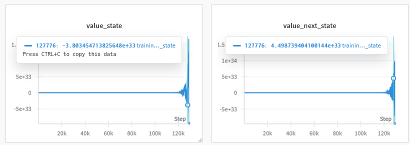

# Work Under Progress

This project is currently under active development. The documentation and implementation may change as development continues.

**Note:** Some functionality is currently unverified and under active development. This includes:
- Implementation of certain algorithms
- Performance optimizations
- Testing and validation
- Documentation updates

# Setup Guide

1. Clone the Repository
```bash
git clone <repository-url>
cd <repository-directory>
```

2. Create and Activate Conda Environment
```bash
# Create new environment
conda env create -f conda_env.yaml
conda activate rl_env
```

3. Install Dependencies
```bash
pip install -r requirements.txt
```

4. Running the test and experiment
```bash
# Test environment
python env.py
# Run experiment
python xprmt.py
```

# Technical Documentation

## Algorithm

### Actor Critic (A2C)
The Actor-Critic algorithm uses a critic to estimate the value function and an actor to update the policy. The critic provides a baseline to reduce variance in policy updates, while the actor directly optimizes the policy parameters. The implementation includes L2 regularization for the critic and entropy regularization for the actor.

**Code Reference:** @agent.py: `class ActorCriticAgent` (lines 72-202)

### Compatible Actor Critic (NAC)
Compatible Actor-Critic ensures that the critic's value function approximation is compatible with the policy gradient by using the same feature representation for both actor and critic. The implementation uses the policy gradient features to update both actor and critic parameters.

**Code Reference:** @agent.py: `class CompatibleActorCriticAgent` (lines 204-322)

### REINFORCE 
REINFORCE directly optimizes the policy using the exact gradient of the expected return, using the average reward as a baseline to reduce variance. The implementation follows the REINFORCE algorithm with a baseline.

**Code Reference:** @agent.py: `class ExactPolicyGradientAgent` (lines 324-415)

### Exhaustive Policy Search
The Exhaustive Policy Search algorithm performs a complete search over all possible deterministic policies to find the optimal one. For each policy, it simulates multiple episodes to estimate the average reward. This method guarantees finding the globally optimal policy but is computationally expensive as it evaluates all possible policy combinations.

**Code Reference:** @agent.py: `class ExhaustiveAgent` (lines 544-580)

# Improvement

## Regularization for avoiding critic hack
The critic hack problem occurs when the critic's value function becomes too optimistic, leading to poor policy updates. To address this, we implement L2 regularization on the critic's parameters. This regularization term penalizes large parameter values, preventing the critic from overestimating state values and ensuring more stable learning. The regularization strength is controlled by the hyperparameter λ_v, which balances between accurate value estimation and preventing overfitting.

**Mathematical Formulation:**
The critic's objective function with L2 regularization is given by:
$$
\mathcal{L}_c = V(s_t) - \lambda_v \sum_{\theta \in \Theta_c} \|\theta\|^2
$$
where:
- $V(s_t)$ is the value function estimate
- $\lambda_v$ is the regularization coefficient
- $\Theta_c$ is the set of critic parameters
- $\|\theta\|^2$ is the L2 norm of each parameter



## Encouraging Exploration Espacing Policy Local Maxima through Entropy
To prevent the policy from getting stuck in local optima, we incorporate entropy regularization in the actor's objective function. This encourages the policy to maintain a certain level of randomness in action selection, promoting exploration of the state space. The entropy term is weighted by λ_e, which controls the trade-off between exploitation (following the current best policy) and exploration (trying new actions). Higher entropy values lead to more uniform action distributions, while lower values result in more deterministic policies.

**Mathematical Formulation:**
The actor's objective function with entropy regularization is given by:
$$
\mathcal{L}_a = \log \pi(a_t|s_t) + \lambda_e \mathcal{H}(\pi(\cdot|s_t))
$$
where:
- $\log \pi(a_t|s_t)$ is the log probability of the taken action
- $\lambda_e$ is the entropy regularization coefficient
- $\mathcal{H}(\pi(\cdot|s_t))$ is the entropy of the policy distribution:
  $$
  \mathcal{H}(\pi(\cdot|s_t)) = -\sum_a \pi(a|s_t) \log \pi(a|s_t)
  $$
  For a Bernoulli policy, this simplifies to:
  $$
  \mathcal{H}(\pi(\cdot|s_t)) = -p \log p - (1-p) \log(1-p)
  $$
  where $p$ is the probability of taking action 1.


# TODO
1. Cartpole only has reward of 1. Manage how to handle this with done to inform agent that
environment end fast is bad.